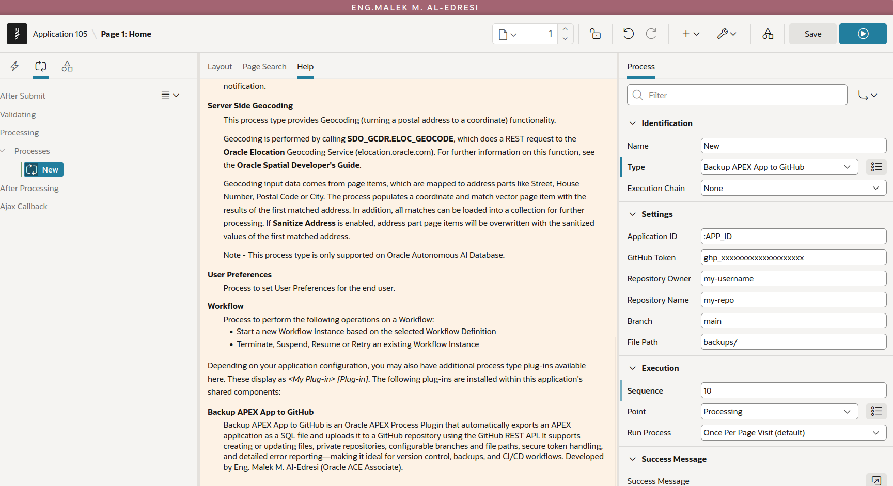

# Backup APEX App to GitHub -- Process Plugin

An Oracle APEX **Process Type** plugin that exports an APEX application as a SQL file and uploads it directly to a GitHub repository using the GitHub REST API.

Ideal for version control, automated backups, and CI/CD workflows -- no file system access required.

---

## Features

- Exports any APEX application as a single SQL file using `APEX_EXPORT`.
- Uploads (creates or updates) the file to GitHub via the Contents API.
- Supports private repositories (with a valid token).
- Configurable branch and file path.
- Handles large applications through chunked Base64 encoding.
- Secure token handling (masked in UI and debug logs).
- Detailed error messages for common failure scenarios.
- Compatible with Page Processes, Automations, Task Definitions, and Workflows.

---

## Quick Start

1. **Import** the plugin file into your APEX application.
2. **Grant** the network ACL for `api.github.com` on port 443.
3. **Create** a Process in Page Designer with type **Backup APEX App to GitHub**.
4. **Fill in** the six attributes (Application ID, GitHub Token, Owner, Repo, Branch, File Path).
5. **Run** the page. The application SQL export appears in your GitHub repository.

For detailed steps, see [docs/installation.md](docs/installation.md).

---

## Plugin Attributes

| # | Attribute | Type | Required | Default | Description |
|---|-----------|------|----------|---------|-------------|
| 1 | Application ID | Number | Yes | `:APP_ID` | The numeric ID of the APEX application to export. |
| 2 | GitHub Token | Text | Yes | -- | Personal access token with `repo` scope (classic) or `contents:write` (fine-grained). |
| 3 | Repository Owner | Text | Yes | -- | GitHub username or organization that owns the repository. |
| 4 | Repository Name | Text | Yes | -- | Exact name of the target repository. |
| 5 | Branch | Text | Yes | `main` | Branch where the backup file will be committed. |
| 6 | File Path | Text | Yes | `apex/app_{APP_ID}_latest.sql` | Path and filename inside the repository. |

---

## Screenshot

The screenshot below shows the plugin configured in Page Designer:

---

## Prerequisites

| Requirement | Details |
|-------------|---------|
| Oracle APEX | 24.1 or later (tested on 24.1, 24.2, 25.1, 26.1) |
| Oracle Database | 19c or later |
| GitHub Token | Classic PAT with `repo` scope, or fine-grained token with Contents read/write |
| Network ACL | Outbound HTTPS access to `api.github.com` on port 443 |
| Target Repository | Must already exist on GitHub |
| Target File | Must already exist in the repository (the plugin updates existing files) |

---

## How It Works

1. The plugin calls `APEX_EXPORT.GET_APPLICATION` to export the application as a CLOB.
2. The CLOB is converted to a BLOB and then Base64-encoded in chunks.
3. A GET request retrieves the SHA of the existing file on GitHub.
4. A PUT request sends the encoded content to the GitHub Contents API, updating the file.
5. On success, a message with a direct link to the committed file is returned.
6. On failure, the exact HTTP status and GitHub error message are raised as an APEX exception.

---

## Troubleshooting

| Error | Cause | Fix |
|-------|-------|-----|
| HTTP 404 -- file not found | The target file does not exist in the repository. | Create a placeholder file at the expected path in GitHub first. |
| HTTP 401 -- unauthorized | Token is invalid or expired. | Regenerate your token with `repo` scope. |
| HTTP 403 -- forbidden | Token lacks permissions for the repository. | Check token scopes and repository access. |
| ORA-29273 -- network failure | ACL not configured or proxy issue. | Ask your DBA to grant the network ACL (see installation guide). |
| Application X not found | The App ID does not exist in the current workspace. | Verify the Application ID in Shared Components. |

Enable **Debug Mode** in APEX to see detailed logs (token is masked to the first 4 characters).

---

## Security Notes

- The GitHub token is stored as a text attribute. Consider using an APEX Substitution String or Application Setting to avoid hard-coding it.
- Debug logs only display the first 4 characters of the token.
- The plugin communicates exclusively over HTTPS.

---

## Author

**Eng. Malek M. Al-Edresi** -- Oracle ACE Associate

- GitHub: [github.com/eng-malek](https://github.com/eng-malek)
- Email: malek.m.edresi@gmail.com

---

## License

This project is licensed under the [Apache License 2.0](LICENSE).

---

## Support

If you find a bug or have a question, please [open an issue](https://github.com/eng-malek/apex-backup-app-to-github-process-plugin/issues).

If this plugin saves you time, consider [buying me a coffee](https://buymeacoffee.com/malek_al_edresi).
